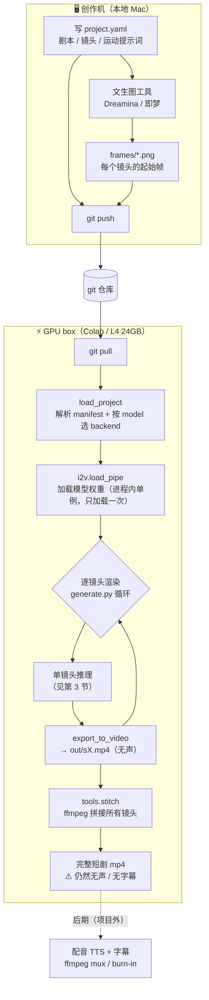
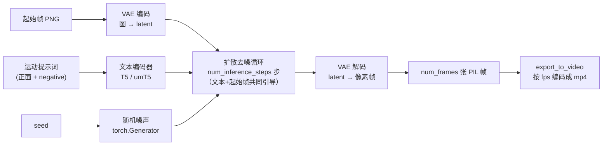

# shotforge 视频生成原理与调试指南

这份文档解释 **一段短剧视频是怎么从「一张起始帧 + 一句提示词」被生成出来的**，
项目结构、端到端工作流、关键技术约束，以及——重点——**当生成结果不符合预期时，
该调哪个旋钮去 debug**。

> 一句话概括：shotforge 是一个「图生视频（image-to-video, I2V）」流水线。
> 你给每个镜头**一张起始帧 PNG** 和**一句描述「画面怎么动」的提示词**，
> 模型把这张静图「续」成一段几秒的视频。**模型只产出无声画面**——没有声音、没有字幕。

---

## 1. 项目结构

```
shotforge/
├── shotforge/                 # 渲染器（所有短剧共用的"主干"代码）
│   ├── backends.py            # 模型注册表：每个模型的类名 + 帧/尺寸约束 + 默认值
│   ├── manifest.py            # 数据模型 + project.yaml 解析（frames_for / snap_dim）
│   ├── i2v.py                 # diffusers 管线封装：加载模型 + 推理生成帧
│   └── generate.py            # 命令行入口：逐镜头渲染成 mp4
├── tools/
│   ├── stitch.py              # 用 ffmpeg 把每个镜头的 mp4 拼成完整短剧
│   └── last_frame.py          # 导出某段视频的最后一帧，用于"接镜"延长一镜
├── projects/
│   └── <短剧名>/              # 一个文件夹 = 一部短剧
│       ├── project.yaml       # 剧本：模型、帧率、每个镜头的起始帧+提示词
│       ├── frames/            # 起始帧 PNG（+ PROMPTS.md 出图提示词），提交进 git
│       └── out/               # 渲染产物 mp4（不提交，见 .gitignore）
└── docs/PIPELINE.md           # 本文档
```

**核心理念：一个渲染器，多部短剧（One renderer, many projects）。**
渲染器代码是共享主干，每部新短剧只是 `projects/` 下一个新文件夹。

---

## 2. 端到端工作流

创作在本地 Mac 做，渲染在 GPU box（Colab / 单卡 L4 24GB）做，中间用 git 同步。



命令（在 GPU box 上）：

```bash
bash setup.sh                                              # 装依赖（不含 torch）
python -m shotforge.generate --project projects/example    # 渲染全部镜头
python -m shotforge.generate --project projects/example --shot s2   # 只渲染一个镜头
python -m tools.stitch       --project projects/example    # 拼接成完整短剧
python -m tools.last_frame   --video out/s1.mp4 --out frames/s1b.png # 接镜延长
```

---

## 3. 一段视频是怎么生成的（单镜头内部）

`i2v.generate()` 渲染一个镜头时，内部经过这些步骤：



逐步拆解：

1. **选模型（backend）**：`load_project` 读 `project.yaml` 的 `model:` 字段，在
   `backends.py` 里查到对应 `Backend`（管线类名、checkpoint、帧/尺寸约束、默认值）。
2. **加载管线**：`i2v.load_pipe(backend)` 按类名从 `diffusers` 动态加载管线，
   `from_pretrained` 拉取权重（Wan I2V 会一并加载其 CLIP image_encoder）。**进程内
   单例**——一次运行只加载一次，后续镜头复用。VAE 与 image_encoder 强制 fp32（避免
   黑帧），并按显存自动决定是否 cpu offload：≥40GB 常驻（更快），更小则流式（`$I2V_OFFLOAD`
   可覆盖）。Wan 还会设置 UniPC 的 `flow_shift`（720P=5.0 / 480P=3.0）。
3. **算帧数**：`frames_for(seconds, fps, quantum)` 把「秒数×帧率」换算成合法帧数
   `num_frames = quantum*N + 1`（LTX 量子=8，Wan=4）。
4. **文本编码**：正面提示词 + negative 提示词经文本编码器（LTX 用 T5，Wan 用 umT5）
   变成向量，引导画面内容/运动。
5. **图像条件**：起始帧经 VAE 编码进 latent 空间，作为「第一帧锚点」约束生成。
6. **扩散去噪**：从随机噪声出发（`seed` 决定噪声，**同 seed + 同输入 = 可复现**），
   在文本与起始帧的共同引导下迭代去噪 `num_inference_steps` 步。步数越多通常越干净也越慢。
7. **VAE 解码**：把去噪后的 latent 解码成 `num_frames` 张像素帧。
8. **编码成 mp4**：`export_to_video` 按 `fps` 把帧序列编码成 `out/<镜头id>.mp4`（**无声**）。

---

## 4. 关键技术约束（绕过就会报错或出垃圾）

| 约束 | LTX | Wan | 在哪处理 |
|---|---|---|---|
| 帧数 `num_frames = 量子*N + 1` | 量子 = 8 | 量子 = 4 | `manifest.frames_for()` |
| 宽/高必须整除 | 32 | 16 | `manifest.snap_dim()` |
| 默认分辨率（9:16 竖屏） | 480×832 | 480×832 | `backends.py` 默认值 |
| 起始帧比例 | 应为 9:16，否则被拉伸 | 同 | 出图时控制 |

- `frames_for` / `snap_dim` 会用**当前 backend 的约束**自动校正——**不要绕过它们手写帧数/尺寸**。
- 起始帧会被缩放到 `width×height`，所以**出图比例要和 `width:height` 一致**（默认 9:16），
  否则画面被拉伸变形。
- `seed` 固定时，相同输入可复现同一结果；改 `seed` 可在"画面崩了"时换一个随机种子重试。

---

## 5. 模型与提示词语言

模型在 `project.yaml` 顶层用一行选择：`model: wan`（默认）/ `wan-480p` / `ltx`。

| 模型 | backend | 文本编码器 | 提示词 | 备注 |
|---|---|---|---|---|
| Wan2.1-I2V-14B **720P** | `wan` | umT5（多语言） | **中文/英文** | **默认**，中文短剧首选；正经 I2V 模型，14B bf16 约 28GB，需 40GB+ 显卡常驻 |
| Wan2.1-I2V-14B 480P | `wan-480p` | umT5 | 中文/英文 | 同族 480P，更轻更快，适合草稿 |
| LTX-Video | `ltx` | T5（偏英文） | **英文** | 轻量快，低显存/快速迭代时用 |

> ⚠️ **I2V = 图 + 文字，不是只给图**：起始帧定「画面长什么样」，每镜头的 `prompt` 定
> 「怎么动」，两者都要。另外：`WanImageToVideoPipeline` 需要带 CLIP image_encoder 的
> **专门 I2V** checkpoint；**Wan2.2-TI2V-5B 没有这个组件、在 diffusers 里做不了 I2V**
> （会只出第一帧），别拿它当 I2V 用。

**关于"中文短剧 vs 英文短剧"**：这里的语言指的是**喂给模型的运动提示词**的语言，
而不是短剧的台词。

- 模型**不认识也不生成台词/字幕**，它只根据提示词控制「画面怎么动」。
- **默认的 `wan`**（umT5 多语言）**直接写中文运动提示词即可**——做中文短剧的推荐配置。
- 若改用 `ltx`（T5 偏英文），运动提示词写**英文**质量更好；剧情是中文完全没关系。
- 短剧的"中文感"（台词、旁白、字幕）属于**后期**层，见第 6 节。

### 切换 / 新增模型

- **切换**：改 `project.yaml` 的 `model:` 即可。
- **临时换具体 checkpoint**（同一族的量化版/微调版）：设环境变量
  `export I2V_MODEL_ID=<huggingface repo id>`，它会覆盖 backend 的默认 checkpoint。
- **新增一个模型**：在 `backends.py` 的 `BACKENDS` 里加一条 `Backend(...)`，
  填管线类名、checkpoint、`frame_quantum`、`dim_multiple`、默认分辨率/步数。
- **类名漂移**：`diffusers` 不同版本里管线类名会变。如果 `load_pipe` 找不到类，
  它会**报错并打印当前已安装版本里所有可用的 I2V 管线类名**——照着改
  `backends.py` 里那条 backend 的 `pipeline_cls` 即可。Wan 的 repo id / 类名 /
  帧约束是**尽力而为的默认值，请在 GPU box 上核对**（见 `backends.py` 注释里的 ⚠️）。

---

## 6. 字幕与配音：模型不产出，需要后期

**这两个模型只生成无声的 RGB 画面，不带任何声音，也不带字幕。** `out/*.mp4` 是哑片。
如果要让短剧"有声有字"，是在渲染**之后**单独做的后期步骤（目前 shotforge 不包含，
属于可扩展方向）：

- **配音**：用 TTS 单独生成语音音轨（中文可用 CosyVoice / edge-tts / 豆包TTS / ElevenLabs 等），
  再用 ffmpeg 把音轨混进视频：
  ```bash
  ffmpeg -i 短剧.mp4 -i 配音.mp3 -c:v copy -c:a aac -shortest 成片.mp4
  ```
- **字幕**：写一个 `.srt`，用 ffmpeg 软挂或硬烧：
  ```bash
  # 硬烧（字幕烧进画面，所有播放器都能看到）
  ffmpeg -i 短剧.mp4 -vf "subtitles=字幕.srt" 带字幕.mp4
  ```
- 若需要画面与配音对齐，可按句拆镜，或用配音时长反推每个镜头的 `seconds`。

> 想把这一步也纳入流水线，可以加一个 `tools/dub.py` / `tools/subtitle.py`，
> 保持"一个文件夹 = 一部短剧"的结构（音轨/字幕也放进 `projects/<名字>/`）。

---

## 7. Debug 指南：结果不对时调哪个旋钮

先看 `generate.py` 的 stdout 日志（`[device]` / `[model]` / `[render]` 行），
确认设备、模型、分辨率、帧数、seed 是否符合预期。然后对照下表：

| 现象 | 可能原因 | 调整 / 排查 |
|---|---|---|
| **CUDA OOM（显存爆）** | 14B 太大放不下；分辨率/时长太大 | `load_pipe` 按显存自动 offload（`$I2V_OFFLOAD=1` 强制）；降 `width`/`height`/`seconds`；用 `model: wan-480p` |
| **只有第一帧、之后空白** | I2V 用错模型（如 TI2V-5B 没 image_encoder）；或 VAE 精度 | 用 `wan`/`wan-480p`（=正经 I2V-14B）；VAE 默认已 fp32，`$I2V_VAE_TILING` 保持不设 |
| **画面糊 / 崩坏 / 扭曲** | 帧数或尺寸不合法；步数太低 | 别手写帧数/尺寸（交给 `frames_for`/`snap_dim`）；`steps` 提到 40–50 |
| **运动中前景融化、越往后越崩** | 动作太猛 + 画面太杂；分辨率非标准档 | 提示词改「基本静止 + 细微动作」；靠 Wan 的 auto_resolution（别写死尺寸）；定稿 50 步；起始帧别太杂 |
| **起始帧被"重画"、不像原图** | 提示词描述了与起始帧冲突的内容 | 提示词**只写运动/镜头**（怎么动、怎么推拉摇移），别重新描述画面内容 |
| **画面被拉伸** | 起始帧比例 ≠ `width:height` | 出图按 9:16；或改 `width/height` 去匹配起始帧比例 |
| **人物变形 / 多手多脚** | 模型固有问题；negative 不够 | 加强 `negative`（deformed, extra limbs, …）；换 `seed`；减少剧烈运动描述 |
| **抖动 / 闪烁** | 帧间不稳；步数低 | 提 `steps`；`negative` 加 `jitter`；固定 `seed` 多试几个 |
| **视频太短** | `seconds` 小 / `fps` 低 | 调大 `seconds`；想超过 ~5s 见 `tools/last_frame` 接镜法 |
| **中文运动提示词不起作用** | LTX 的 T5 偏英文 | LTX 改用英文运动提示词；或把 `model` 改成 `wan`（中文友好） |
| **每次结果都不一样** | `seed` 没固定 | 固定 `seed`（同 seed + 同输入可复现） |
| **只想微调某一个镜头** | — | `--shot sX` 只渲染它，反复改它的 `seed`/`steps`/`prompt` |
| **导入报错 `XxxPipeline 不存在`** | diffusers 类名漂移 | 看报错里打印的可用类名，改 `backends.py` 的 `pipeline_cls` |
| **frame not found（找不到帧）** | 路径相对项目目录，文件名不符 | 检查 `frames/` 里文件名与 `project.yaml` 一致；`--project` 指向对的文件夹 |
| **视频没有声音 / 没有字幕** | 模型只产画面（正常现象） | 见第 6 节，后期单独加 |

**调参的一般顺序**（先便宜后贵）：
1. 换 / 固定 `seed`（最便宜，先排除"运气差"）。
2. 改 `prompt`（让它只描述运动，别和起始帧打架）。
3. 提 `steps`（40 → 50）。
4. 降分辨率/时长（解决 OOM 或太慢）。
5. 还不行就**换起始帧**——起始帧的质量/构图往往是上限，提示词救不回一张差图。

> 复现性：固定 `seed` + 不改起始帧/提示词，结果可稳定复现，方便对比每次只改一个变量的效果。
